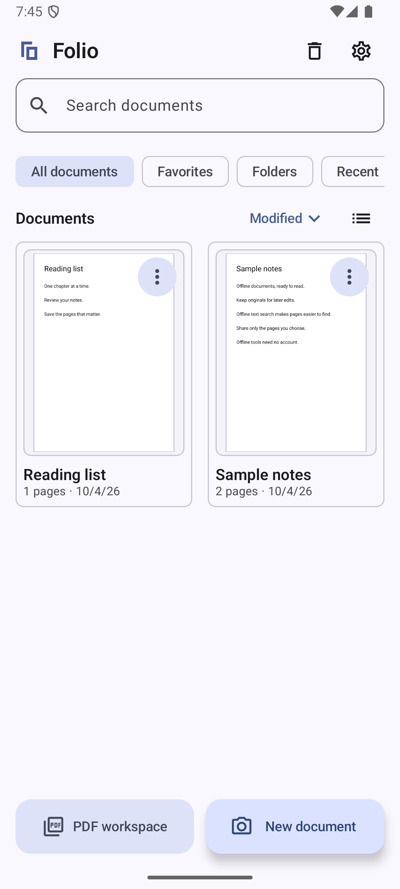
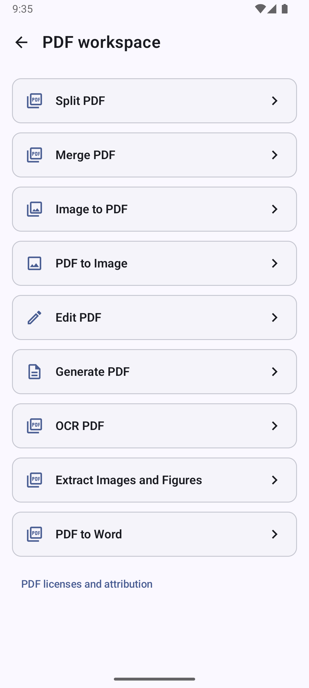
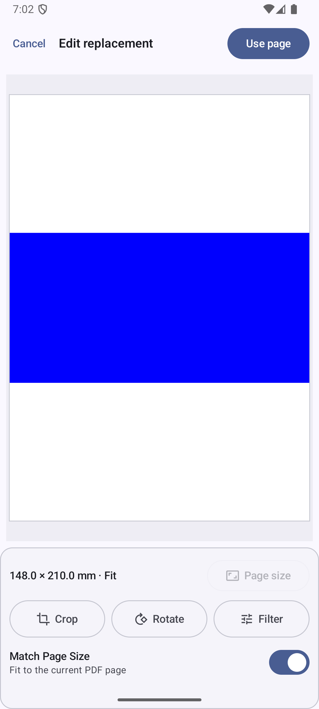
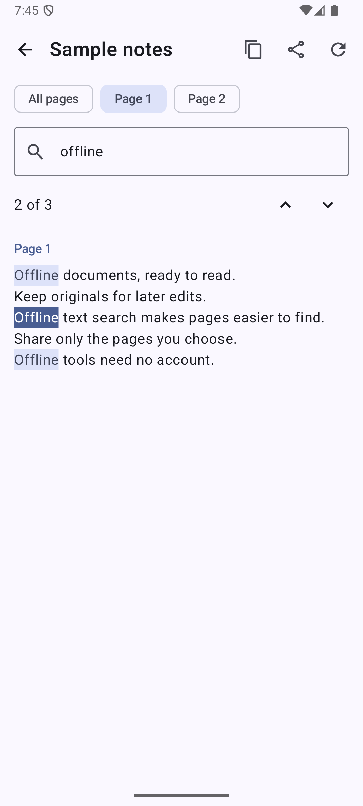
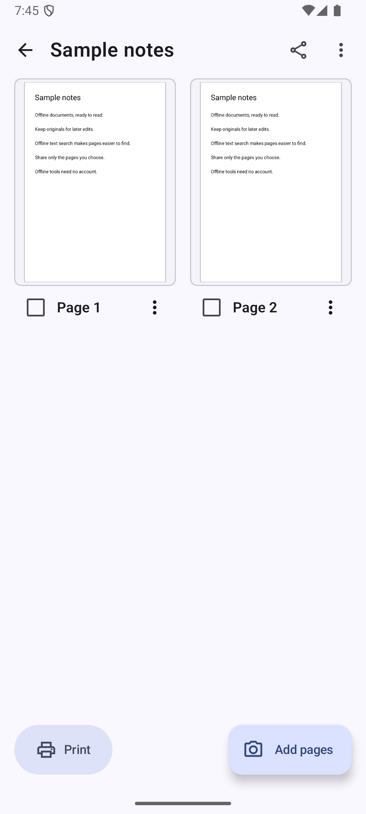
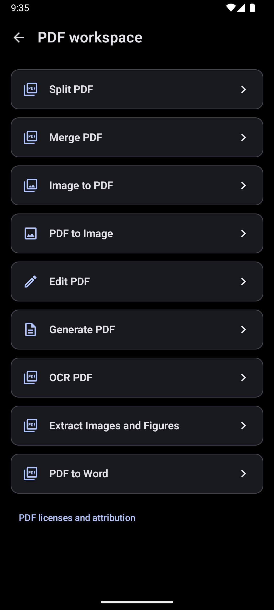

<div align="center">

<h1>Folio</h1>
<p><strong>Your paper documents. A searchable library. Useful PDF tools.</strong></p>
<p>An Android document scanner with offline OCR, retained originals, and a separate PDF Workspace.</p>
<p>Android 8.0+ · Kotlin &amp; Compose · Material 3 · AGPL-3.0</p>
<p><a href="BUILDING.md">Build</a> · <a href="docs/GOOGLE_DRIVE_SETUP.md">Google Drive</a> · <a href="docs/MODELS.md">Models &amp; OCR</a> · <a href="PRIVACY.md">Privacy</a> · <a href="docs/TESTING.md">Tests</a></p>

</div>

## Demo video

[▶ Watch the Folio demo](docs/Folio_vid.mp4?raw=true)

## A closer look

Real Folio screens, captured with safe sample content. No personal documents or connected accounts are shown.

<table>
<tr>
<td align="center"><br><b>Document library</b></td>
<td align="center"><br><b>PDF Workspace</b></td>
<td align="center"><br><b>Page replacement</b></td>
</tr>
<tr>
<td align="center"><br><b>Search extracted text</b></td>
<td align="center"><br><b>Page management</b></td>
<td align="center"><br><b>AMOLED theme</b></td>
</tr>
</table>

## What you can do

| Workflow | Capabilities |
| --- | --- |
| **Scan** | Live LCNet corner detection, multi-page camera capture, image import, manual corners with a magnifier, perspective correction. |
| **Edit** | Retained original images, crop, rotate, enhancement presets and adjustments, zoom inspection, page-size preview. |
| **Organize** | Folders, favorites, grid/list views, sorting, rename, duplicate, move, long-press selection and page ordering. |
| **Read & search** | Offline PaddleOCR, background or on-demand extraction, library text search, selectable text, highlighted word/phrase matches with previous/next navigation. |
| **PDF Workspace** | Generate PDF from Folio pages, image to PDF, merge, split, PDF to PNG, and edit a working copy: draw, rotate, reorder, remove or replace pages. |
| **Share & print** | Android Sharesheet, PDF/image exports, separate or combined documents, selected-page exports, Android print preview for all or selected pages. |
| **Recover** | Document/page Recycle Bin, restoration, permanent deletion, automatic removal after 60 days. |
| **Appearance** | Light, dark and AMOLED themes with system dynamic colors on Android 12+. |

PDF replacement accepts an image or a selected PDF page, with a live **Match Page Size** preview. Exports offer quality/compression and password protection where supported. Larger PDF jobs use WorkManager with progress, cancellation and interrupted-operation recovery.

The PDF Workspace works with device files independently of the library and exports new files; it does not overwrite the original source PDF. PDF editing is page manipulation and drawing, not editing existing PDF text.

## Get started

This archive is a **source release**, not a signed APK. Build an APK using [BUILDING.md](BUILDING.md), then install the variant matching your device. Android API 26 or newer is required.

Open Folio, choose **New document**, and grant camera permission to scan. You can import images instead. Open **PDF workspace** to work with device PDFs and images. Scanning, editing, OCR and PDF tools require no account.

## Google Drive Backup — approved test users only

**Google Drive Backup in the public Folio release is currently available only to approved Google OAuth test users.**

If you download Folio and want Google Drive Backup, contact the project owner with the Google account email address you want to use. The owner must manually add your account to the Google Cloud OAuth **Test Users** list before you can authenticate and use backup. Use the public contact method provided by the repository/profile, if available; this source package does not publish a private contact address.

**Backup is not open to unrestricted Google accounts.** Source builders must configure their own Cloud project and public Web Client ID; this package contains no owner OAuth configuration or client secret.

Backup is optional. Connecting an account does not upload your library. Automatic backup needs explicit opt-in. The current restore-first safety policy locks uploads on a fresh installation until a nonempty existing Folio backup has been restored. Read [the Drive guide](docs/GOOGLE_DRIVE_SETUP.md) before relying on backup.

## Built with

| Component | Version in this source release |
| --- | --- |
| Kotlin / Compose compiler | 2.4.20 |
| Android Gradle Plugin / Gradle | 9.4.1 / 9.6.0 |
| Compose BOM / CameraX | 2026.06.01 / 1.6.2 |
| Room / Hilt / WorkManager | 2.8.5 / 2.60.1 / 2.12.0 |
| OpenCV / ONNX Runtime Android | 4.14.0 / 1.30.0 |
| iText Community Android | 9.8.0 |

Compose screens use existing repositories and coroutines; Room stores library and durable operation state. Hilt supplies application dependencies. WorkManager handles OCR, PDF jobs, backup, cloud deletion and trash maintenance. CameraX provides capture; OpenCV handles image transformations; Android PdfRenderer provides PDF previews.

```text
app/src/main/          Application, resources, bundled models and notices
app/src/test/          JVM tests
app/src/androidTest/   Android integration/UI tests and attributed fixtures
app/schemas/           Room migration schemas
gradle/wrapper/        Pinned Gradle wrapper
third-party-sources/   iText Android corresponding source archives
docs/                 Setup, models, testing and safe screenshots
scripts/check.ps1     Build, unit tests and lint (optional device tests)
```

## Build and test

Use JDK 21 and Android SDK platform 36; the configured wrapper selects Gradle. See [BUILDING.md](BUILDING.md) for SDK installation and optional OAuth setup.

```powershell
.\gradlew.bat :app:assembleDebug :app:testDebugUnitTest :app:lintDebug
```

On a dedicated emulator or test device:

```powershell
.\gradlew.bat :app:connectedDebugAndroidTest
```

Tests create and delete sample library data: do not run instrumentation against a personal Folio installation. [Testing notes](docs/TESTING.md) distinguish executed checks from manual device acceptance.

## Privacy and limitations

Document images and OCR stay on the device unless you explicitly share/export them or enable Drive backup. There is no analytics or advertising integration in the inspected source. Android OS backup is disabled. See [PRIVACY.md](PRIVACY.md).


- Printed English OCR has automated coverage. Handwriting, mathematics, other languages and complex layouts are not promised. Check extracted text for mistakes.
- OCR has a CPU fallback. NNAPI is requested on eligible devices; actual supported node execution varies. XNNPACK is CPU acceleration. GPU acceleration is not guaranteed.
- Exported PDFs do not currently embed an OCR text layer. Replacing a PDF page rasterizes that selected page; its vector/text content is not retained in the replacement.
- Drive access and the restore-first upload lock are intentional current limitations.

## License and acknowledgements

Folio is distributed under [GNU AGPL v3](LICENSE). iText Community Android uses AGPL terms; retain applicable notices and provide corresponding source when distributing binaries. Its Android source archives are included in [third-party-sources](third-party-sources).

LCNet comes from [DocsaidLab DocAligner](https://github.com/DocsaidLab/DocAligner). Offline OCR uses the official [PaddlePaddle PP-OCRv6_small ONNX models](docs/MODELS.md). Their upstream licenses and provenance are recorded in [THIRD_PARTY.md](docs/THIRD_PARTY.md) and [bundled notices](app/src/main/assets/licenses). Test photographs are attributed to MakeACopy and are not user captures.

For contributions, see [CONTRIBUTING.md](CONTRIBUTING.md). Report vulnerabilities privately as described in [SECURITY.md](SECURITY.md); never post private documents, credentials or account information in public issues.

